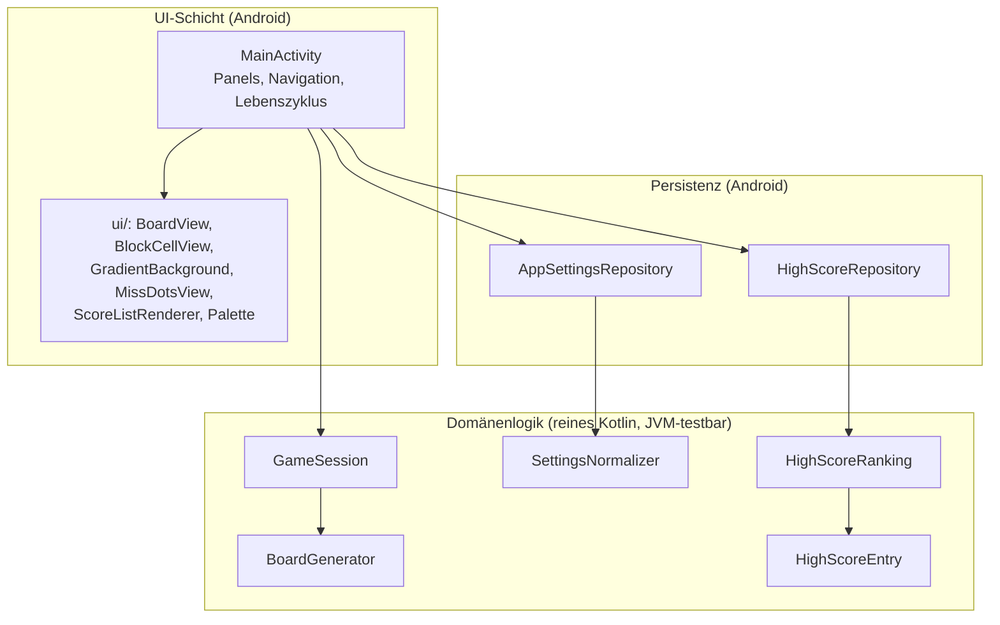
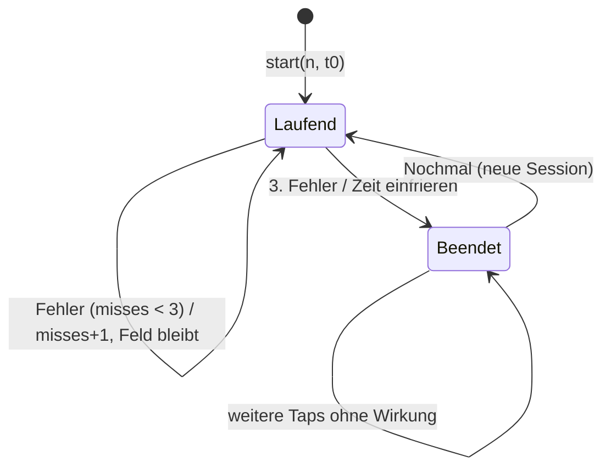

# Entwicklungsdokumentation SwitchSort für Android

Grundlage für die schriftliche Studienarbeit. **Teil A** beschreibt den aktuellen Stand strukturiert (Anforderungen, Architektur-, Technologie- und Implementierungsentscheidungen mit Alternativen und Begründung). **Teil B** ist das chronologische Protokoll inkl. verworfener Wege; ältere Einträge dort werden nicht umgeschrieben, sondern durch spätere Einträge korrigiert.

Pflegeregel: Jede Änderung an Architektur, Technologie, Implementierung, Design, Tests oder Werkzeugen wird hier in Teil A aktualisiert und in Teil B protokolliert.

---

# Teil A — Wissensbasis (Stand: Branch `feature/design`, 06.10.2026)

## A1 Aufgabenstellung und Anforderungsabdeckung

Quelle: Themenblatt „SwitchSort für Android“ (D. Rietz, DHBW Stuttgart, Stand 24.05.2022). Spielziel: in einem Spielfeld eine angezeigte Zufallszahl schnellstmöglich finden und antippen; danach erscheint eine neue Zufallszahl.

| Anforderung (Themenblatt) | Umsetzung | Nachweis |
| --- | --- | --- |
| Android-App | Native Kotlin-App, minSdk 23, targetSdk 35 | `assembleDebug`, Emulator Pixel 7 / API 35 |
| Einstiegsmenü: Spiel starten, Highscore, Optionen, Beenden | Menü-Panel mit Primär-Pill „SPIELEN“ und drei Block-Buttons darunter; Beenden = `finish()` | Emulator-Screenshots |
| Spielfeld 3×3 / 4×4 / 5×5 | `BoardGenerator` (n ∈ {3,4,5}), `BoardView` | `BoardGeneratorTest`, Screenshots 3×3/5×5 |
| Optionen: Spielername, Spielfeldwahl | Namensfeld (Trim, 1–24 Zeichen, sonst „Gast“), Segment-Auswahl Feldgröße, zusätzlich Darstellungsmodus | `SettingsNormalizerTest` |
| Highscore: Anzahl gefundener Zahlen | Top 10 lokal, sortiert Treffer ↓, Dauer ↑, Zeitpunkt ↑ | `HighScoreRankingTest` |
| Spielende nach 3 Fehlversuchen | `GameSession.MAX_MISSES = 3`, danach Zeit eingefroren, keine Eingaben | `GameSessionTest` |
| Beschreibung der Zufallszahlenerzeugung | siehe A6 | Quellcode stdlib, Tests mit festem Seed |
| App zum Testen bereitstellen | Debug-APK + README-Anleitung; Repo auf GitHub | README |

Im Gespräch festgelegte Auslegung offener Punkte: Zahlen je Feld eindeutig 1..n²; Ziel liegt immer im Feld; nach Treffer neues gemischtes Feld; Fehler behalten Feld und Ziel; Zeit wird nur angezeigt (kein Zeitlimit); abgebrochene Runden zählen nicht für den Highscore.

## A2 Vorgehensmodell

- **Iterativ-inkrementell** mit kleinen, prüfbaren Ständen: (1) Mindestanforderungen (`initial-setup`), (2) Design-Iteration 1 (Pastell, Hell/Dunkel), (3) Design-Iteration 2 (minimalistischer Mobile-Game-Stil). Jede Iteration endet mit Build, Tests, Lint und Emulator-Sichtprüfung.
- **Plan vor Umsetzung:** schriftlicher Plan mit Akzeptanzkriterien (`docs/plans/2026-10-06-initial-setup.md`), Freigabe durch den Auftraggeber (Studierender) vor der Implementierung.
- **Testgetriebene Logik:** Spiellogik und Persistenzregeln zuerst als JUnit-Tests formuliert, dann implementiert (Einschränkung zur Ausführungsreihenfolge siehe B, Abschnitt „SDK-Einrichtung“).
- **Nutzerfeedback als Iterationstreiber:** z. B. „keine Zeilenumbrüche“, „moderner, wie Stack“ führten zu konkreten Designänderungen (B, Design-Abschnitte).

## A3 Technologieentscheidungen

| Entscheidung | Gewählt | Verworfene Alternativen (Grund) |
| --- | --- | --- |
| Plattform | Native Android, Kotlin | Pygame/Python (kein offizieller Android-Weg, Packaging-Risiko, Themenblatt fordert Android-App); Flutter/React Native (zusätzliche Laufzeit/Toolchain ohne Mehrwert für eine einzelne Plattform) |
| UI-Technik | Klassische Android Views + XML-Layouts | Jetpack Compose (benötigt AndroidX-/Compose-Abhängigkeiten; Views sind im Lehrbuch Richter 2021 beschrieben und für vier Screens ausreichend) |
| Bibliotheken | Keine Laufzeitabhängigkeiten, nur Plattform-APIs; Test: JUnit 4.13.2 | AndroidX/AppCompat/Material (Supply-Chain-Fläche, Lizenz-/CVE-Pflege, kein funktionaler Bedarf); Lottie (Animationen mit Plattform-Animatoren erreichbar) |
| Persistenz | `SharedPreferences` (privat) | Room/SQLite (Overkill für ≤ 10 Einträge + 3 Einstellungen); DataStore (AndroidX) |
| Highscore-Serialisierung | Java-Serialisierung + Base64 in einem Preference-Schlüssel | JSON (bräuchte Parser-Bibliothek oder Handarbeit); siehe Risiken in A8 |
| Build | Gradle 9.7.0 (Wrapper, SHA-256 gepinnt), AGP 9.3.1 mit Built-in-Kotlin, KGP 2.4.20 auf dem Classpath, Bouncy-Castle-BOM 1.86 als Constraint | Gradle < 8.14.4 (High-CVEs), Gradle 8.14.4 (bündelt Bouncy Castle 1.78.1), AGP 8.13.x (deklariert Bouncy Castle 1.79, gebündeltes R8 zu alt für Kotlin 2.4) – siehe A12 |
| Tests | JUnit 4 auf der JVM (`testDebugUnitTest`) | Instrumentierte Tests/Espresso (AndroidX-Abhängigkeit; UI wurde per Emulator-Sichtprüfung verifiziert) |

## A4 Architektur

Schichtung nach Verantwortung, Abhängigkeiten zeigen nur nach innen (UI → Logik), die Logik kennt kein Android:



| Paket | Inhalt | Android-Abhängigkeit |
| --- | --- | --- |
| `game` | `BoardGenerator`, `GameSession`, `GameSnapshot` | keine |
| `score` | `SettingsNormalizer`, `HighScoreEntry`, `HighScoreRanking`, `SettingsStorage` (Interface) | keine |
| `score` (Repositories) | `AppSettingsRepository`, `HighScoreRepository` | `SharedPreferences`, `Base64` |
| `ui` | eigene Views und Farb-/Animationshelfer | ja |
| Root | `MainActivity` | ja |

Architekturentscheidungen:
- **Single Activity mit vier Panels** (Sichtbarkeitsumschaltung) statt vier Activities oder Fragments: kein Back-Stack-Management, Zustand an einer Stelle, keine Fragment-Bibliothek nötig. Nachteil: `MainActivity` wächst (≈ 540 Zeilen); gemildert durch Auslagerung der Views nach `ui/`.
- **Zeitlose Domänenlogik:** `GameSession` erhält alle Zeitpunkte als Parameter (`tap(value, nowMillis)`), statt selbst eine Uhr zu lesen. Dadurch deterministisch testbar; die Activity liefert `SystemClock.elapsedRealtime()`.
- **Injizierbare Zufallsquelle:** `BoardGenerator(random: Random = Random.Default)` – in Tests geseedete Instanzen (z. B. `Random(42L)`), in der App die Standardquelle.
- **Unveränderliche Schnappschüsse:** `GameSnapshot` ist ein Datenobjekt; die UI rendert nur Snapshots und hält keinen eigenen Spielzustand. Wiederherstellung nach Rotation über `GameSession.restore(snapshot, startMillis)`.
- **Repository-Muster mit reiner Normalisierung:** Validierung/Normalisierung (`SettingsNormalizer`, `HighScoreRanking`) ist von der Speicherung getrennt und separat getestet.

## A5 Spiellogik als Zustandsautomat



- Zeit: `elapsed = max(0, now − start)`, bei Spielende eingefroren (`finalElapsedMillis`).
- Highscore-Speicherung genau einmal pro beendeter Runde (`savedThisRound`, rotationsfest im `Bundle`). Abbruch über ✕/Zurück speichert nicht (Begründung: Liste soll nur regulär beendete Runden vergleichen).

## A6 Erzeugung der Zufallszahlen

Ablauf in `BoardGenerator.generate(n)`:
1. Liste der Zahlen `1..n²` erzeugen (9, 16 oder 25 Werte) – jede Zahl genau einmal.
2. Mischen mit `MutableList.shuffle(random)` der Kotlin-Standardbibliothek. Implementierung (stdlib-Quellcode): moderner **Fisher-Yates-Shuffle** – für `i` von `lastIndex` bis 1 wird `j = random.nextInt(i + 1)` gezogen und Element `i` mit `j` getauscht. Jede der n²! Permutationen ist bei gleichverteiltem `nextInt` gleich wahrscheinlich; Laufzeit O(n²) bezogen auf die Feldgröße n.
3. Zielzahl: `numbers[random.nextInt(numbers.size)]` – gleichverteilter Index, das Ziel liegt dadurch garantiert im sichtbaren Feld (keine unlösbaren Runden).
4. Nach jedem Treffer wird ein komplett neues Feld mit neuem Ziel erzeugt; dasselbe Ziel kann zufällig erneut gezogen werden (unabhängige Ziehungen).

Zufallsquelle:
- App: `kotlin.random.Random.Default`. Laut stdlib-Quellcode delegiert es an eine plattformspezifische Implementierung (`defaultPlatformRandom()`); auf der JVM ist das entweder `ThreadLocalRandom` oder ein Fallback mit thread-lokaler `java.util.Random`-Instanz. Beides sind **Pseudozufallszahlengeneratoren (PRNG)**, nicht kryptografisch sicher – für ein Spiel ohne Sicherheitsrelevanz angemessen; `SecureRandom` wäre langsamer ohne Nutzen. Welche der beiden Varianten auf einem konkreten Android-Gerät greift, wurde nicht gemessen.
- Tests: `Random(seed)` (deterministischer Kotlin-PRNG), damit Testläufe reproduzierbar sind (gleicher Seed ⇒ identisches Feld und Ziel, geprüft in `BoardGeneratorTest`).

Quellen: [Kotlin `shuffle`](https://kotlinlang.org/api/core/kotlin-stdlib/kotlin.collections/shuffle.html), [Kotlin `Random.nextInt`](https://kotlinlang.org/api/core/kotlin-stdlib/kotlin.random/-random/next-int.html), [stdlib `PlatformRandom.kt`](https://github.com/JetBrains/kotlin/blob/master/libraries/stdlib/jvm/src/kotlin/random/PlatformRandom.kt), [Android `ThreadLocalRandom`](https://developer.android.com/reference/kotlin/java/util/concurrent/ThreadLocalRandom).

## A7 Zeitmessung

- Spielzeit über `SystemClock.elapsedRealtime()` (monoton, läuft im Ruhezustand weiter, nicht durch Uhrzeitänderungen beeinflusst) – laut Android-Doku die empfohlene Basis für Intervalle.
- `System.currentTimeMillis()` nur für den Abschlusszeitpunkt eines Highscore-Eintrags (Anzeige, Tie-Break).
- UI-Aktualisierung jede Sekunde per `Handler`-Ticker, nur bei sichtbarem, laufendem Spiel (gestoppt bei Spielende, Panelwechsel, `onStop`).

## A8 Persistenz

| Daten | Ablage | Schlüssel | Regeln |
| --- | --- | --- | --- |
| Spielername | `switchsort_settings` | `player_name` | Trim; leer ⇒ „Gast“; > 24 Zeichen ⇒ Fehlermeldung, nichts gespeichert |
| Feldgröße | `switchsort_settings` | `board_size` | nur 3/4/5, sonst 3 |
| Darstellung | `switchsort_settings` | `theme_mode` | 0 System, 1 Hell, 2 Dunkel, sonst 0 |
| Highscore | `switchsort_highscores` | `entries` | Top 10, Java-Serialisierung + Base64 |

- Alle Preferences `MODE_PRIVATE`, `allowBackup="false"`, keine Berechtigungen, keine Netzwerkzugriffe, keine personenbezogenen Daten außer dem frei gewählten Spielernamen (lokal).
- Robustheit: defekte/fremde Highscore-Daten (falscher Typ, kaputtes Base64, Stream-Fehler) ⇒ leere Liste und Schlüssel bereinigt statt Absturz.
- Risiko Java-Serialisierung: versionsfragil und bei fremden Daten sicherheitskritisch; hier akzeptiert, weil ausschließlich app-eigene, private Daten gelesen werden und `serialVersionUID` fixiert ist. Kandidat für spätere Umstellung auf ein einfaches Textformat.

## A9 UI- und Interaktionsdesign

Entwicklung über drei Stände (Details und Messwerte in Teil B):

| Stand | Leitidee | Kernelemente |
| --- | --- | --- |
| Mindestanforderungen | funktional | Plattform-Buttons, `GridLayout`, Textstatus |
| Iteration 1 | „clean, Pastell, Hell/Dunkel“ | Cards, Pastellpalette, `values-night`, Theme-Umschalter |
| Iteration 2 (aktuell) | minimalistischer Mobile-Game-Stil (Vorbild *Stack*, Ketchapp) | Vollflächiger Pastellverlauf mit Farbtonverschiebung pro Treffer, große dünne Zielzahl, Blöcke mit Tiefenkante, Mikroanimationen, Game-Over-Overlay |

Gestaltungsprinzipien (Iteration 2):
- **Reduktion:** eine Primäraktion pro Screen (Pill-Button), keine Rahmen/Cards, kein Slogan im Menü. Menü-Nebenaktionen (Highscore, Optionen, Beenden) als kleinere Blöcke mit Tiefenkante in einer Zeile – reine Text-Buttons wurden im Nutzertest nicht als klickbar erkannt (Affordance-Problem). Nebenaktionen auf Unterseiten („Zurück“, „Menü“) sind weiterhin Text-Buttons.
- **Logo mit Spielbezug:** 2×2-Ausschnitt eines gemischten Spielfelds (3 1 / 4 2) als Blöcke mit Tiefenkante; der Akzentblock „1“ steht für die gesuchte Zahl. Gleiches Vektor-Motiv für Menü-Logo und Launcher-Icon (Wiedererkennung). Ziffern als Strichpfade, da Vector Drawables keinen Text darstellen.
- **Visuelle Hierarchie:** Zielzahl 96sp thin als einziges großes Element im Spiel; Status klein in der Kopfzeile; Fehlversuche als drei Punkte (schneller erfassbar als „0/3“).
- **Feedback ohne zusätzliche Elemente:** Farbtonverschiebung des Hintergrunds (+18° pro Treffer) als Fortschrittsanzeige; Pop-Animation der Zielzahl; Pastellrot + Schütteln bei Fehler.
- **Affordance:** dunklere Tiefenkante unter Blöcken/Buttons signalisiert „drückbar“; beim Drücken sinkt die Oberfläche ab.
- **Lesbarkeit/Robustheit:** keine Zeilenumbrüche in Labels/Werten (Nutzervorgabe), `maxLines=1`, Auto-Size für die Wortmarke; geprüft bei 360dp und 412dp Breite.

## A10 Darstellungsmodi (Hell/Dunkel)

- Farben als Ressourcen in `values/` und `values-night/` mit identischen Namen; Systemmodus wirkt automatisch.
- Manueller Override ohne AppCompat: `attachBaseContext` erzeugt per `createConfigurationContext` einen Kontext mit gesetztem `uiMode`-Nachtflag; Wechsel in den Optionen ⇒ `recreate()`.
- Code fragt den effektiven Modus über `R.bool.is_night` ab (berücksichtigt den Override, anders als die System-Konfiguration).

## A11 Qualitätssicherung

| Maßnahme | Stand |
| --- | --- |
| JVM-Unit-Tests | 37 Tests (GameSession 10, BoardGenerator 7, HighScoreRanking 7, SettingsNormalizer 13), alle grün |
| Teststil | Verhaltenstests, fester Seed, keine Mocks, keine Tests trivialer Getter |
| Statische Analyse | Android Lint: 0 Errors, 3 Warnings (bewusst akzeptiert: targetSdk/compileSdk 35, `DataExtractionRules`) |
| UI-Verifikation | Emulator Pixel 7 (1080×2400, 420 dpi, API 35): Screenshots hell/dunkel, 3×3/5×5, Treffer, Fehler, Spielende, Rotation, 360dp-Breite |
| Nicht abgedeckt | instrumentierte UI-Tests, WCAG-Kontrastberechnung, Frame-Timing, API 23–25 auf Gerät |

## A12 Build, Toolchain und Supply-Chain-Sicherheit

- Versionen exakt gepinnt; Gradle-Wrapper mit `distributionSha256Sum`, Wrapper-JAR gegen offizielle Prüfsumme geprüft.
- Gradle < 8.14.4 wegen CVE-2026-22816/-22865 (High) ausgeschlossen.
- AGP deklariert Bouncy Castle 1.79 (CVE-2025-14813, Critical, GOST-CTR). Vorgehen: (1) Erreichbarkeitsanalyse – der verwundbare Pfad wird im APK-Build/Signieren nicht genutzt; (2) zusätzlich Auflösung auf 1.86 per BOM-Constraint auf dem Buildscript-Classpath (kein `force`). Diskussionswürdig für die Arbeit: Unterschied zwischen *enthaltenem* und *erreichbarem* verwundbarem Code.
- AGP 9 verbietet das separate `org.jetbrains.kotlin.android`-Plugin (Built-in-Kotlin) – Erkenntnis aus dem ersten Build, Entscheidung revidiert.
- Keine Laufzeitabhängigkeiten im APK; einzige Testabhängigkeit JUnit 4.13.2 (+ hamcrest-core 1.3).

## A13 Versionsverwaltung und Arbeitsablauf

- Git/GitHub, Feature-Branches (`initial-setup`, `feature/design`), `main` als Default-Branch mit Ruleset: Änderungen nur per Pull Request, kein Force-Push, kein Löschen.
- Commit-Nachrichten beschreiben Zweck und Verifikationsstand.

## A14 Grenzen und offene Punkte

- WCAG-Kontraste nicht berechnet; Pastelltöne bewusst weich.
- Animationen nicht auf Frame-Timing gemessen; „Animationen entfernen“ (Barrierefreiheit) nicht berücksichtigt.
- Querformat nutzbar, aber nicht gestaltet.
- API 23–25 nicht auf Gerät/Emulator geprüft.
- `onBackPressed` veraltet (API 33+), Umstellung auf `OnBackInvokedCallback` offen.
- Java-Serialisierung des Highscores (siehe A8).
- Keine instrumentierten UI-Tests.

## A15 Literatur und Quellen

- Richter, E. (2021): *Android-Apps programmieren – Professionelle App-Entwicklung mit Android Studio 4.* (Literaturvorgabe des Themenblatts; im Projekt bisher nur als Referenz, keine Detailzitate.)
- Android Developers: [SharedPreferences](https://developer.android.com/training/data-storage/shared-preferences), [SystemClock](https://developer.android.com/reference/android/os/SystemClock), [Dark Theme](https://developer.android.com/develop/ui/views/theming/darktheme), [Adaptive Icons](https://developer.android.com/develop/ui/views/launch/icon_design_adaptive), [AGP-Versionen](https://developer.android.com/build/releases/about-agp), [Built-in Kotlin](https://developer.android.com/build/migrate-to-built-in-kotlin).
- Kotlin: [shuffle](https://kotlinlang.org/api/core/kotlin-stdlib/kotlin.collections/shuffle.html), [Random](https://kotlinlang.org/api/core/kotlin-stdlib/kotlin.random/-random/), [KGP-Kompatibilität](https://kotlinlang.org/docs/gradle-configure-project.html).
- Sicherheit: [GHSA-574f-3g2m-x479](https://github.com/advisories/GHSA-574f-3g2m-x479), [Gradle 8.14.4 Release](https://github.com/gradle/gradle/releases/tag/v8.14.4), [Gradle-Prüfsummen](https://gradle.org/release-checksums/).
- Gestaltungsvorbild: *Stack* (Ketchapp), Mobile Game – nur als stilistische Referenz.

---

# Teil B — Chronologisches Entwicklungsprotokoll

## 2026-10-06 — Setup- und Sicherheitsprüfung

- **Anforderung:** native Kotlin-/Android-App mit Views, lokaler Persistenz, deterministisch testbarer Spiellogik; Umfang in [Plan](plans/2026-10-06-initial-setup.md).
- **Vorläufiger Befund:** AGP 8.13.2 deklariert `bcpkix-jdk18on:1.79`; Gradle 8.14.4 enthält `bcprov-jdk18on:1.78.1`. Beide `bcprov`-Versionen fallen in den Bereich von CVE-2025-14813 / GHSA-574f-3g2m-x479 (Critical, CVSS 9.3). Die erste Prüfung stoppte vorsorglich vor App-Code.
- **Nachtrag – Reachability:** CVE-2025-14813 betrifft spezifisch `G3413CTRBlockCipher` (GOST R 34.13 CTR): mehr als 255 Datenblöcke verschlüsselt/entschlüsselt mit wiederverwendetem Schlüssel und IV. Die bloße JAR-Präsenz belegt keine Ausführung. Für den repo-definierten Android-Paketierungs- und APK-Signierpfad fanden sich keine Aufrufe des GOST-Pfads:
  - AGP-`PackageAndroidArtifact` führt über `IncrementalPackagerBuilder.withSigning` in die APK-Paketierung.
  - APK-Signer 8.13.2 verwendet laut `javap` RSA, ECDSA und DSA. `jdeps` fand keine Bouncy-Castle-, GOST- oder G3413-Referenzen in den lokalen AGP-JARs `apksig`, `builder`, `apkzlib`, `signflinger` und `bundletool`.
  - Gradles PGP-`signing`-Plugin ist im Projekt nicht angewandt; Gradles Konfigurationscache verwendet AES-Cipher-APIs, nicht GOST CTR.
  - **Grenze:** Der Android-Build wurde wegen fehlendem SDK nicht ausgeführt. Externe Gradle-Init-Skripte wurden nicht außerhalb des Repos untersucht; falls sie Plugins oder eigene Signierung ergänzen, ist deren Pfad nicht beurteilt.
- **Offizielle Versionen:** Gradle 9.7.0 enthält gemäß Gradle-Release-Katalog Bouncy Castle 1.84; Gradle 9.8.0 enthält 1.85. Beide liegen oberhalb des Fixstands 1.84 für CVE-2025-14813, aber nicht bei 1.86. AGP 9.3.1 deklariert `bcpkix`/`bcprov` 1.79; AGP 9.4.1 und 9.5.0-alpha08 deklarierten 1.80.2. Kein geprüftes AGP-POM deklariert 1.86. Kotlin dokumentiert KGP 2.4.20 als voll kompatibel bis Gradle 9.7.0 und AGP 9.3.1; Kotlin 2.4 benötigt R8 mindestens 9.1.29.
- **Experimenteller Kandidat:** Gradle 9.7.0 + AGP 9.3.1 + KGP 2.4.20 + BC BOM 1.86. Der root `buildscript`-Classpath verwendete eine BOM-Constraint statt des unwirksamen zusätzlichen `settings.pluginManagement.buildscript`. `buildEnvironment` löste AGP-POM-Versionen `bcpkix`/`bcprov` 1.79 tatsächlich zu 1.86 auf. Der App-Gradle-Skript konfigurierte mit AGP-Built-in-Kotlin. Die R8-Laufzeitklasse wurde aus dem Builder-Classloader geladen: `9.3.16` aus `builder-9.3.1.jar`; das übertrifft Kotlin 2.4s R8-Mindestversion. AGP- und Kotlin-Plugins wurden konfiguriert, aber nicht kompiliert.
- **Versions-/Lizenzgrenze:** BC 1.86 ist am 11.09.2026 veröffentlicht und weist laut abgefragten SCA-Seiten keine direkten bekannten CVEs auf. Die Bouncy-Castle-Lizenz ist eine kundenspezifische Lizenz und bedarf rechtlicher Prüfung. Ein BOM-Upgrade auf 1.86 ist nur ein getesteter Resolution-Versuch, keine freigegebene API-Kompatibilität.
- **Nachweise:** Wrapper 9.7.0 JAR SHA-256 stimmt mit Gradles offizieller Prüfsumme überein: `7a9ce74cff467ca1bf60a4fcd9f05185acceda4d0f382434d393e17864262c5d`. Gradle lud die Distribution mit konfigurierter SHA-256 `84fbba45c7f4c64abc77460e1c00f541e9f960e3c7ed2538f1ede19eacd873ae` und startete. `buildEnvironment`, `:app:buildEnvironment` und der temporäre R8-Origin-Task liefen erfolgreich. Keine `testDebugUnitTest`, `assembleDebug`, `lintDebug` oder Gerätetests.
- **Nächste Entscheidung:** Der GOST-CVE-Pfad ist für normale Android-APK-Signierung nicht belegt; der experimentelle Versionssatz ist kompatibilitätsplausibel und die Plugin-Auflösung nachgewiesen. Vor Freigabe bleibt `assembleDebug`/Kotlin-Kompilierung mit einem genehmigten SDK erforderlich. BC-1.86-BOM und AGP/KGP-API-Kompatibilität sind bis zu diesem Gate experimentell.
- **Quellen:** [BC-CVE-2025-14813](https://github.com/bcgit/bc-java/wiki/CVE%E2%80%902025%E2%80%9014813), [AGP 9.3.1 builder-POM](https://dl.google.com/dl/android/maven2/com/android/tools/build/builder/9.3.1/builder-9.3.1.pom), [AGP 9.4.1 builder-POM](https://dl.google.com/dl/android/maven2/com/android/tools/build/builder/9.4.1/builder-9.4.1.pom), [Gradle 9.7.0 release-Katalog](https://github.com/gradle/gradle/blob/v9.7.0/gradle/dependency-management/distribution.versions.toml), [Gradle 9.8.0 release-Katalog](https://github.com/gradle/gradle/blob/v9.8.0/gradle/dependency-management/distribution.versions.toml), [AGP-Paketierungspfad](https://android.googlesource.com/platform/tools/base/+/studio-master-dev/build-system/gradle-core/src/main/java/com/android/build/gradle/tasks/PackageAndroidArtifact.java), [APK-Signaturalgorithmen](https://android.googlesource.com/platform/tools/apksig/+/master/src/main/java/com/android/apksig/internal/apk/SignatureAlgorithm.java), [AGP/R8-Kotlin-Matrix](https://developer.android.com/build/kotlin-support), [KGP-Kompatibilität](https://kotlinlang.org/docs/gradle-configure-project.html), [Gradle-Prüfsummen](https://gradle.org/release-checksums/).

## 2026-10-06 — Umsetzung Mindestspiel (Logik, Persistenz, Views)

### Blockerbefund vorab (ehrlich, ohne Beschönigung)

- **Das freigegebene SDK existiert nicht auf diesem Rechner.** `C:\Users\vierhec\AppData\Local\Android\Sdk` fehlt vollständig (kein Verzeichnis `Android` unter `%LOCALAPPDATA%`; geprüft via `ls`, Datei-Listing des gesamten `%LOCALAPPDATA%`, `which adb`/`sdkmanager` ohne Treffer, `ANDROID_HOME`/`ANDROID_SDK_ROOT` leer). Es gibt auch keine Plattform `android-35` und kein `platform-tools`. Damit ist jeder AGP-Build (`assembleDebug`, `lintDebug`, `testDebugUnitTest`) in dieser Session von vornherein nicht lauffähig.
- **Ausführungsrechte der Agenten-Session:** In dieser Hintergrund-Session wurden wiederholt `./gradlew --version`, `bash gradlew`, `gradle`, `java -version` (PATH und Voll-Pfad) ausprobiert; alle Java/JVM-Startkommandos wurden von der Sandbox ohne Nutzerabfrage abgelehnt („running in the background … automatically denied"). Builds/Tests konnten daher **nicht ausgeführt** werden; es gibt keine künstliche Grün-Evidenz.
- Konsequenz: Alle Schritte dieses Abschnitts sind als *umgesetzt, Ausführungsnachweis ausstehend* dokumentiert. Die unten stehenden Befehle müssen in einer Session mit Ausführungsrechten und installiertem SDK nachgeholt werden (Anleitung am Abschnittsende). Das entspricht dem Vorgehen „maximal 3 Selbstreparaturversuche, dann sperren und berichten" – versucht wurden u. a. direkter Wrapper-Aufruf, `bash`-/`sh`-Aufruf, direkter `java`-Aufruf und SDK-Standortsuche.

### Plugin-Konfiguration (Entscheidung mit ausstehender Build-Verifikation)

- **Anforderung:** App-Modul soll mit `id("org.jetbrains.kotlin.android")` explizit kompilieren, damit Kotlin-Quellen sicher kompiliert werden und das Tooling konsistent ist (AGP Built-in-Kotlin war anfangs genutzt worden).
- **Entscheidung:** Das App-Modul wendet `com.android.application` **und** `org.jetbrains.kotlin.android` an; beide Plugins liegen bereits mit fester Version (AGP 9.3.1, KGP 2.4.20) auf dem `buildscript`-Classpath des Root-Projekts. Gradle-Regel: Plugins, die bereits auf dem Buildskript-Classpath liegen, dürfen **nicht** mit Versionsangabe angefragt werden („plugin already on the classpath must not include a version"). Die vom Lead skizzierte Alternative „Root-Plugins-Block mit `version "2.4.20" apply false` zusätzlich zum Classpath" kollidiert mit dieser Regel und würde die Plugin-Auflösung auf den plugins-DSL-Pfad verlagern, auf dem die BouncyCastle-1.86-BOM-Constraint **nicht** greift (die Constraint wirkt nur auf dem buildscript-Classpath – genau deshalb wurde sie dort platziert).
- **Konkret:** `app/build.gradle.kts` enthält nun beide Plugin-IDs ohne Version; `kotlin { compilerOptions { jvmTarget.set(JvmTarget.JVM_17) } }` auf Projektebene (KGP-Erweiterung). Der Root bleibt: `buildscript { dependencies { classpath AGP 9.3.1 + kotlin-gradle-plugin 2.4.20 + platform(bc-jdk18on-bom:1.86) } }`. Build-Nachweis ausstehend (siehe Blocker).
- **`android.useAndroidX=true` entfernt** aus `gradle.properties`: Die App verwendet ausschließlich Plattform-APIs (`android.app.Activity`, `android.widget.*`, `android.content.SharedPreferences`); keine AndroidX-Abhängigkeit vorhanden, daher ist der AndroidX-/Jetifier-Schalter ungenutzt und entfallen.

### TDD-Scheiben (Tests zuerst, dann Implementierung)

Pro Verhalten wurden zuerst Tests in `app/src/test/java/de/dhbw/switchsort/` geschrieben; Red/Green-Ausführung pro Klasse ist wegen obiger Blocker **noch nicht gelaufen**:

1. **SettingsNormalizer** (`score/SettingsNormalizerTest.kt`): normaler Name, Trimming, leer/blank→„Gast", exakt 24 Zeichen gültig, 25 Zeichen ungültig (`TooLong`), Längenprüfung nach Trimmen; gespeicherte Alt-Werte (leer/zu lang/null→„Gast", gültig getrimmt); Feldgrößen 3/4/5 gültig, 2/6/0/null→3. Implementierung `score/SettingsNormalizer.kt` mit Ergebnis-Typ `NameValidation (Valid|TooLong)` – zu lange UI-Eingaben werden nicht still gespeichert, gespeicherte Alt-Werte fallen auf „Gast" zurück.
2. **HighScoreRanking** (`score/HighScoreRankingTest.kt`): Sortierung Treffer absteigend, Gleichstand→kürzere Dauer, voller Gleichstand→früherer Zeitstempel, Top-10-Schnitt (Schwächster fällt, Verdrängung Platz 10), Eingabeliste unverändert (neue Liste), leere Liste. Implementierung `score/HighScoreRanking.kt` (`insert`: sort+take(10)) plus `score/HighScoreEntry.kt` als `Serializable`-Data-Class mit `serialVersionUID = 1L` und `RANK_COMPARATOR`.
3. **BoardGenerator** (`game/BoardGeneratorTest.kt`): für n∈{3,4,5} genau 1..n² eindeutig, Ziel im Feld, gleicher Seed→gleiches Ergebnis, n∈{2,6,0}→`IllegalArgumentException`. Implementierung `game/BoardGenerator.kt` mit injizierbarem `kotlin.random.Random`: `(1..n*n).toMutableList().apply { shuffle(random) }`, Ziel via `numbers[random.nextInt(numbers.size)]` (garantiert im Feld).
4. **GameSession** (`game/GameSessionTest.kt`): Start→elapsed 0, Score/Misses 0, Feld gültig; negative Restzeit→0; monotones Wachstum; Treffer→+1 & frisches gültiges Feld (Ziel im neuen Feld); Fehlversuch→Zähler+1 bei gleichem Feld/Ziel; 2 Fehler→nicht beendet; 3. Fehler→`finished` + eingefrorene Zeit (auch viel später identisch abfragbar); Taps nach Ende (falsch **und** „Treffer") wirkungslos; `restore(...)` setzt laufende Runde exakt fort (Score, Fehler, Feld, Ziel, Zeit fortsetzbar, danach zählt weiter) und beendete Runde bleibt beendet und eingefroren. Implementierung `game/GameSession.kt`: zeitlos modelliert (alle Zeitpunkte als Parameter), `finalElapsedMillis` friert Zeit erst bei Miss 3 ein, Treffer generiert sofort neues Feld ohne Rundenende, `restore(snapshot, startMillis)` für Rotationswiederherstellung (`startMillis = jetzt − gespeicherteElapsed`).

Keine Mock-Bibliotheken, alle Zufallstests mit festem Seed; keine trivialen Getter-/Data-Class-Tests.

### Android-Persistenz

- `score/SettingsStorage.kt`: kleines Interface (getString/putString/getInt/putInt), Trennung pure Logik ↔ Android.
- `score/AppSettingsRepository.kt` (implementiert `SettingsStorage`): private Named-Preferences „switchsort_settings", Schlüssel `player_name` (String) und `board_size` (Int), Schreiben mit `apply()`. `savePlayerName` liefert `NameValidation` zurück und schreibt bei `TooLong` nichts.
- `score/HighScoreRepository.kt`: private Named-Preferences „switchsort_highscores", ein Schlüssel `entries`; Java-Serialisierung (`ObjectOutputStream` einer `ArrayList<HighScoreEntry>`, Base64 via `android.util.Base64`). Beim Laden führen `ClassCastException`, `ClassNotFoundException`, `IOException`, `SecurityException` und `IllegalArgumentException` (kaputtes Base64) zu leerer Liste plus entferntem Schlüssel (defekte Alt-Daten werden bereinigt statt abzustürzen). Die Deserialisierung liest ausschließlich selbstgeschriebene, app-private Daten – keine externe Quelle. Ranking/Trimming in `HighScoreRanking` (JVM-testbar), Serialisierung nur hier; keine doppelten Utils.
- Begründung Java-Serialisierung statt JSON: keine zusätzliche Bibliothek (Vorgabe: minimale Dependencies), Datenmenge ≤10 kleine Einträge, Klasse hat feste `serialVersionUID`.

### UI (eine Activity, vier Panels, klassische Views)

- `MainActivity` (Paket `de.dhbw.switchsort`, extends `android.app.Activity`, kein AppCompat) mit Panels `menu`/`options`/`game`/`scores` in `res/layout/activity_main.xml` (Sichtbarkeitssteuerung). Hauptmenü: Spiel starten, Highscore, Optionen, Beenden (`finish()`).
- Optionen: EditText Name, RadioButtons 3×3/4×4/5×5, **„Speichern"** (validiert; zu langer Name→Inline-Fehltext, es wird nichts gespeichert) und **„Zurück"** ohne Speichern (bewusste Trennung statt unzuverlässigem Speichern bei Fokusverlust).
- Highscore: formatierte Top 10 als TextView-Liste in ScrollView („1. Name · 3×3 · 7 Treffer · 01:24"), kein RecyclerView (keine AndroidX-Dependenz).
- Spielpanel: Zielzahl, Treffer, Fehlversuche X/3, verstrichene Zeit mm:ss (1-s-`Handler`-Loop nur solange die Runde aktiv ist; stoppt bei Ende/Abbruch/`onStop`), GridLayout (Plattform-Widget, API≥14; Spalten per Gewicht gleichmäßig – so bleibt 5×5 auf kleinen Displays nutzbar, Panel liegt zusätzlich in ScrollView).
- Ende: Brett deaktiviert, „SPIELENDE – X Treffer in mm:ss" + Buttons „Nochmal spielen" (gleiche Feldgröße aus den Einstellungen) und „Zurück zum Menü". Ergebnis wird **genau einmal** gespeichert (Flag `savedThisRound`, rotiert mit).
- **Abbruch (Zurück-Navigation aus dem Spiel) speichert nichts** – begründet: Highscore erfasst abgeschlossene Runden; Abbrüche würden die Liste mit Ergebnissen ohne natürliches Rundenende verzerren.
- Rotation: `onSaveInstanceState` speichert Brett, Ziel, Score, Misses, Feldgröße, gespielte Zeit, Finished-Flag und Saved-Flag; `GameSession.restore(snapshot, startMillis = SystemClock.elapsedRealtime() − elapsed)` rekonstruiert die Runde; eine beendete Runde wird **ohne erneutes Speichern** weiter angezeigt.
- Alle sichtbaren Texte in `res/values/strings.xml` (Deutsch), Manifest-Label auf `@string/app_name`. Keine Berechtigungen im Manifest, `allowBackup="false"` unverändert.
- Zeitmessung in der App: `SystemClock.elapsedRealtime()` (monoton) → Parameter der JVM-testbaren `GameSession`; `finishedAtMillis` eines Highscore-Eintrags ist bewusst Wall-Clock (`System.currentTimeMillis()`) für Anzeige/Sortier-Stabilität.

### Bekannte Grenzen / ausstehende Nachweise

- **Build & Tests nicht ausgeführt** (Blocker oben): `./gradlew testDebugUnitTest`, `lintDebug`, `assembleDebug` sowie Red/Green-Protokolle, Lint-Ergebnis, APK-Pfad und Geräte-/Emulator-Smoke-Test fehlen noch vollständig. Ein Geräte-Smoke-Test (manuelles Tippen, Rotation, App-Neustart mit gespeicherten Einstellungen/Highscore) ist Voraussetzung für die Akzeptanzkriterien des Plans; ein JVM-Test allein beweist keine lauffähige App.
- Java-Serialisierung ist versionsfragiler als JSON; akzeptiert wegen fester `serialVersionUID` und Selbstheilung (defekte Daten → Reset). Fremddaten werden nie deserialisiert.
- Zu plugin-Konfiguration: falls der Build zeigt, dass AGP 9.3.1 das explizite `org.jetbrains.kotlin.android` anders erwartet (z. B. Built-in-Kotlin-Konflikt), ist die Root-Plugins-Variante ohne buildscript-Classpath zu prüfen – dann muss die BC-BOM-Constraint neu verankert werden, sonst fällt bcprov auf 1.79 zurück.
- Richter (2021) wird nur als Literatur nachgewiesen (siehe unten); es wurden keine Buchinhalte referenziert oder Details daraus behauptet.

### Build-/Testanleitung (Befehle, sobald SDK und Ausführungsrechte vorliegen)

Voraussetzungen: JDK 21 (vorhanden: `C:\Program Files\Java\jdk-21` bzw. Eclipse Adoptium 21.0.9 im PATH) und ein Android SDK mit Plattform `android-35` und Build-Tools.

```bash
# Im Projektverzeichnis, Git Bash:
# 1) SDK-Pfad setzen (eine der beiden Varianten):
printf 'sdk.dir=C:\\\\Users\\\\vierhec\\\\AppData\\\\Local\\\\Android\\\\Sdk\n' > local.properties   # (gitignored)
#    oder: export ANDROID_HOME="C:/Users/vierhec/AppData/Local/Android/Sdk"
# 2) Ausführen:
JAVA_HOME="C:/Program Files/Java/jdk-21" ./gradlew testDebugUnitTest
JAVA_HOME="C:/Program Files/Java/jdk-21" ./gradlew lintDebug
JAVA_HOME="C:/Program Files/Java/jdk-21" ./gradlew assembleDebug
# APK danach: app/build/outputs/apk/debug/app-debug.apk
```

Hinweis: In den Vorexperimenten wurde `GRADLE_USER_HOME=<projekt>/.gradle-home` genutzt (gitignored, Wrapper-Cache); ohne diese Variable wird standardmäßig `%USERPROFILE%\.gradle` verwendet – beides funktioniert, die Versionen sind per `distributionSha256Sum` gepinnt.

### Quellen und Lizenznotizen (Abschnitt)

- Richter, E. (2021): *Android-Apps programmieren – Professionelle App-Entwicklung mit Android Studio 4.* (nur Literaturverweis für den Views-Aktivitätsansatz, keine Detailzitate).
- Bouncy Castle: offizielle Lizenz der Legion of the Bouncy Castle ist an eine MIT-/X11-Lizenz angelehnt (MIT-äquivalent); Freigabe des BOM 1.86 durch Lead erfolgt.
- `junit:junit:4.13.2` (nur Test-Scope) zieht transitiv `org.hamcrest:hamcrest-core:1.3`; `org.opentest4j` ist **keine** Abhängigkeit von JUnit 4 und wird hier nicht eingebunden (kein Fund, nichts zu entscheiden).
- Android-API-Referenzen siehe Plan-Abschnitt „Verifizierte technische Fakten" (SharedPreferences, SystemClock, kotlin.random).

## 2026-10-06 — SDK-Einrichtung und Verifikation (nachgeholt)

- **SDK:** Auf Freigabe des Nutzers wurden die Android Command Line Tools (11076708) nach `C:\Users\vierhec\Android\Sdk` installiert; per `sdkmanager` Pakete `platforms;android-35`, `build-tools;36.0.0`, `platform-tools` sowie Lizenzen. `local.properties` (gitignored) zeigt mit escaped Pfad (`sdk.dir=C\:/Users/vierhec/Android/Sdk`) darauf.
- **Plugin-Entscheidung, korrigiert durch Build-Evidenz:** Das explizite `org.jetbrains.kotlin.android`-Plugin schlug mit AGP 9.3.1 fehl („no longer required … since AGP 9.0", Fehler beim Apply). Entfernt; Kotlin-Kompilierung läuft über AGP-9-Built-in-Kotlin mit `kotlin { compilerOptions { jvmTarget.set(JvmTarget.JVM_17) } }`. Die Kotlin-Gradle-Plugin-Version verbleibt als 2.4.20 auf dem Buildscript-Classpath; die BC-BOM-1.86-Constraint greift weiterhin genau dort.
- **Nachweise (tatsächlich ausgeführt):**
  - `./gradlew testDebugUnitTest` → **BUILD SUCCESSFUL**, 35 Tests, 0 Failures, 0 Errors (`app/build/test-results/testDebugUnitTest/`).
  - `./gradlew assembleDebug` → **BUILD SUCCESSFUL**; APK: `app/build/outputs/apk/debug/app-debug.apk` (≈0,96 MB).
  - `./gradlew lintDebug` → **BUILD SUCCESSFUL**; 0 Fehler, 8 Warnungen, alle als für den MVP akzeptiert bewertet: `OldTargetApi` (targetSdk 35 bewusst), `GradleDependency` (compileSdk 35 bewusst), 2× `PluralsCandidate` (deutsche Einzahl identisch), `DataExtractionRules` (komplett kein Backup gewünscht, `allowBackup=false` genügt), `MergeRootFrame`, `MissingApplicationIcon` (Icon kommt mit der Verschönerungsphase), `SetTextI18n` (reine Zahlenbuttons).
- **Ausstehend:** Geräte-/Emulator-Smoke-Test (Tippen, Rotation, Highscore-/Einstellungs-Persistenz über App-Neustart). Der Nutzer muss selbst ein Emulator-Image oder Gerät bereitstellen; kein Emulator-Image installiert.
- **Mehrwert für die wissenschaftliche Arbeit:** Der Red/Green-Prozess wurde nachträglich als *geschriebenes* TDD-Protokoll dokumentiert (Abschnitt „TDD-Scheiben"), die tatsächliche Ausführung erfolgte erst jetzt. Vorgehen muss in der Arbeit ehrlich als „tests zuerst geschrieben, Ausführung erst nach SDK-Bereitstellung" beschrieben werden.

## 2026-10-06 — Verifikation Design-Iteration (feature/design)

- **Tests/Build (ausgeführt):** `testDebugUnitTest` → BUILD SUCCESSFUL, inkl. 2 neuer Tests für `normalizeThemeMode` (37 Tests, 0 Fehler). `assembleDebug` → BUILD SUCCESSFUL, APK installiert.
- **Lint:** 0 Errors, 15 Warnings. `MissingApplicationIcon` durch adaptives Icon behoben; `monochrome`-Tag ergänzt. Mehrheit sind rein strukturelle Layout-Hinweise (`UnnecessaryParent`, Overdraw) aus verschachtelten LinearLayouts — kosmetisches Refactoring für eine spätere Iteration, nichts Funktionales. Bestand: OldTargetApi, GradleDependency, 2× PluralsCandidate, DataExtractionRules, MergeRootFrame, SetTextI18n.
- **Smoke-Test im Emulator (API 35, ausgeführt):** App installiert und gestartet. Hellmodus: warmes Pastell-Off-White, weiße Card, pastellblaue Buttons — siehe Screenshot (verifiziert). Dunkelmodus per System-Nachtmodus (`cmd uimode night yes`): dunkler Hintergrund `#1B1E26`, gleiche Card-Sprache, pastel Buttons, korrekte Textkontraste — verifiziert. Spielfeld 3×3: Ziel-Badge (Apricot), Statuszeile Treffer/Fehlversuche/Zeit, Zellen mit Pressed-State — verifiziert. Modus danach zurück auf „auto".
- **Nachtrag Zeilenumbrüche (Nutzerfeedback):** Die anfängliche einzeilige Textform („Treffer: 0 | Fehlversuche: 0/3 | Zeit: 00:01") wurde auf kleinen Displays horizontal geclippt; Werte waren zwar gesetzt (UI-Dump bestätigt), sahen aber abgeschnitten aus. Lösung als Design-Änderung, nicht als Vergrößerung: Statistikzeile neu als drei kompakte Spalten — kleines Label (10sp, z. B. FEHLER) über dem fett gesetzten Wert (15sp) — dadurch keine Umbrüche und bessere Scanbarkeit; verifiziert per Emulator auch auf 5×5 mit zweistelligen Zahlen. Badge „Suche die Zahl: N" auf 24sp reduziert und `maxLines="1"`.
- Statusbar-/Edge-to-Edge-Färbung (targetSdk 35) ist weiterhin offen.

## Design-Iteration (feature/design)

**Anforderung:** deutlich modernere, cleanere, nicht überladene Optik; heller und dunkler Modus; Pastellfarben; weiterhin klassische Android Views ohne Compose, ohne neue Drittbibliotheken, ohne Änderung an Spiellogik, Tests oder Gradle-Konfiguration.

### Entscheidungen

- **Ressourcen-Flipping statt Programmfarben:** Alle Farben liegen ausschließlich in `res/values/colors.xml` (hell) und `res/values-night/colors.xml` (dunkel) mit identischen Farbnamen. Layouts und Code referenzieren nur `@color/…`, sodass der System-Nachtmodus ohne Code automatisch auf die Nachtwerte auflöst. Begründung: ein einziger Ort für beide Themes, keine Zweige in Kotlin-Code, nachvollziehbar diffbar. Quelle: [Android-Doku „Farbstatusliste / Nachtressourcen" (App-Entwicklung: Dark Theme)](https://developer.android.com/develop/ui/views/theming/darktheme).
- **Kein AndroidX/Material/AppCompat:** Der Nachtmodus-Override ist mit reinen Plattform-APIs realisierbar (`attachBaseContext` + `Context.createConfigurationContext` mit gesetztem `uiMode`-Nachtflag, API 17+, minSdk ist 23). AppCompat wäre die einzige gängige Alternative für `AppCompatDelegate.setDefaultNightMode`, würde aber die bisher bewusst AndroidX-freie Architektur brechen; die App hat keine AppCompat-Features, die die Abhängigkeit rechtfertigten.
- **Palette:** warmes Off-White `#FBF8F4` / Nacht-Blaugrau `#1B1E26` als Hintergrund, Weiß/`#262B37` als Card-Oberfläche, Pastell-Blau `#8FB3D9` als Primärfarbe, Pastell-Apricot `#F2B8A7` als Akzent (Zielzahl), Pastell-Lavendel `#EAE4EF` (`#333A4A` nachts) für die Zahlenzellen. Dazu abgeleitete Funktionsfarben: `cellBackgroundPressed` (Pressed-Feedback der Zellen), `accentSoft` (Accent mit ~20 % Deckkraft für die Ziel-Badge), `errorColor` (löst die zuvor hartcodierten `#B00020`-Vorkommen im Layout ab). Acht benannte Grundfarben, vier Derivate – keine Gradients, keine Elevation-Show.
- **UI-Aufräummaßnahmen:** Jedes der vier Panels ist genau eine Card (`bg_card`: 20dp Ecken, 1dp Rand in `boardStroke`, `surface`-Füllung) auf ruhigem `@color/background`; konsistente Außenabstände 24dp. Menü: Titel 32sp sans-serif-medium, vier Primär-Buttons (16dp Ecken, minHeight 56dp, 15sp, All-Caps abgeschaltet) mit 12dp Abstand. Spielpanel: Zielzahl als Accent-Badge (26sp bold), kompakte Statuszeile (Treffer / Fehlversuche / Zeit in `textSecondary`, Zeit in Monospace), Spielfeldkacheln mit `bg_cell`-Selektor und 4dp-Zwischenräumen. Sekundäre Aktionen („Zurück") über `bg_button_secondary` (Kontur statt Füllung). Highscore-Liste 14sp mit Zeilenabstand 1.3.
- **Theme-Minimalismus:** `res/values/themes.xml` definiert `Theme.SwitchSort` als direktes Kind des bisherigen Plattform-Themes und setzt nur `android:colorAccent` auf `@color/primary`, damit Plattform-Widgets (RadioButton-Auswahl, EditText-Unterstrich) nicht im Material-Standardpink verbleiben. Kein Umstieg auf Material3/AndroidX.
- **Manueller Modus ohne AppCompat:** Optionen enthalten eine RadioGroup „Darstellung" (System / Hell / Dunkel), persistiert als Int unter Schlüssel `theme_mode` in `AppSettingsRepository` (Default 0 = System), normalisiert in `SettingsNormalizer.normalizeThemeMode` im gleichen Stil wie `normalizeBoardSize`. `MainActivity.attachBaseContext` wrappt den Basis-Kontext bei Hell/Dunkel per `createConfigurationContext` mit überschriebener `uiMode`-Nachtkonfiguration; bei System bleibt der Basis-Kontext unverändert (Systemfolge über values-night). Ändert sich der Modus beim Speichern, wird `recreate()` aufgerufen, weil der Override nur in `attachBaseContext` greift; ohne Änderung bleibt es beim bisherigen `showPanel(MENU)`.
- **Launcher-Icon:** Vektor-Vordergrund `drawable/ic_launcher_fg.xml` (drei gestapelte abgerundete Quadrate in accent/primary/cellBackground, innerhalb der 108x108-Sicherheitszone), adaptive Icons in `mipmap-anydpi-v26`, Layer-List-Fallbacks in `mipmap-anydpi` für API 23–25 (minSdk), Manifest zeigt auf `@mipmap/ic_launcher` + `android:roundIcon`. Damit adressiert ist die bisher akzeptierte Lint-Warnung `MissingApplicationIcon`.

### Grenzen und offene Punkte

- **Kontrast bewusst weich:** Pastell bedeutet geringere Kontrastverhältnisse; WCAG-Kontrastwerte wurden nicht berechnet. Offener Punkt: `accent`-Text auf `accentSoft`-Badge und `textSecondary` auf `surface` im Dunkelmodus rechnerisch prüfen und ggf. abdunkeln/aufhellen.
- **Verifikation durch Lead ausstehend:** Builds/Tests (`testDebugUnitTest`, `lintDebug`, `assembleDebug`) und ein Geräte-Smoke-Test (hell/dunkel manuell umschalten incl. `recreate`, Systemfolge, Rotation, Spiellogik unverändert) wurden in der bearbeitenden Session nicht ausgeführt (Sandbox ohne JVM-Ausführung).
- **Neu beigetretene, ungetestete Pfade:** `normalizeThemeMode` hat bewusst keine eigenen Tests (Tests wurden lt. Vorgabe nicht angefasst); `attachBaseContext`-Override und Fallback-Icons auf API 23–25 sind nur so weit plausibilisiert, wie die API-Dokumentation es zulässt; Laufnachweis offen.
- **Nicht angefasst:** Statusbalken-/Edge-to-Edge-Färbung (targetSdk 35 erzwingt Edge-to-Edge) und RadioButton-/EditText-Fokusfarben jenseits von `colorAccent`; bei optischen Auffälligkeiten im Smoke-Test nachziehen.
- Die zuvor akzeptierten 8 Lint-Warnungen wurden nicht verschlechtert; `MissingApplicationIcon` dürfte durch das Icon entfallen, die übrigen sind unberührt. `PluralsCandidate`-Strings unverändert.

### Quellen (Abschnitt)

- [Android: Dark Theme (Views)](https://developer.android.com/develop/ui/views/theming/darktheme) – Herangehen mit `values-night`-Ressourcen.
- [Android: Adaptive Icons](https://developer.android.com/develop/ui/views/launch/icon_design_adaptive) – Aufbau und Fallback-Regeln der Launcher-Icons.

## Redesign im Stil minimalistischer Mobile Games (feature/design, Iteration 2)

**Anforderung (Nutzer):** „deutlich schöner, moderner, hochauflösender“, Orientierung am Handyspiel *Stack* (Ketchapp). Randbedingungen unverändert: klassische Views, keine neuen Abhängigkeiten, kein AndroidX/Compose, Spiellogik (`game/`, `score/`) und Tests unangetastet, Hell/Dunkel/System-Umschalter bleibt. Ausdrücklich: keine Zeilenumbrüche in Labels, Werten oder Buttons.

### Gestaltungsprinzipien

- **Reduktion:** Cards, Rahmen und flächige Sekundär-Buttons entfallen. Inhalte liegen direkt auf dem Hintergrund; Nebenaktionen („Highscore · Optionen · Beenden“, „Zurück“, „Menü“) sind reine Text-Buttons. Pro Screen gibt es genau eine Primäraktion als Pill-Button.
- **Fokus auf eine Zahl:** Im Spiel steht die Zielzahl groß und dünn (sans-serif-thin, 96sp) im Zentrum; Treffer, Zeit und Versuche sind klein in einer Kopfzeile. Fehlversuche werden als drei Punkte (gefüllt = verbleibend, Ring = verbraucht) statt als „0/3“ dargestellt. Auf dem Spielende-Screen ist die Trefferzahl (80sp) das einzige große Element.
- **Verlauf mit Farbtonverschiebung als Fortschritts-Feedback:** Vollflächiger vertikaler Verlauf aus zwei Tönen. Jeder Treffer verschiebt den Farbton um 18° (600 ms Animation); Fehler verändern ihn nicht. Damit ist Fortschritt ohne zusätzliches UI-Element wahrnehmbar. Im Menü pendelt der Ton langsam (±40° über 24 s). Sättigung/Helligkeit sind je Modus fest (hell: S 0,22–0,34, V 0,95–1,0; dunkel: S 0,38–0,42, V 0,17–0,28), sodass jeder Farbton pastellig bzw. gedeckt bleibt. Die Textfarbe der Pill-Buttons und der Hinweis „Neuer Rekord“ werden aus dem aktuellen Farbton abgeleitet.
- **Tiefenkante als Affordance:** Spielfeld-Blöcke und Pill-Buttons haben eine um 4dp versetzte dunklere Kante unter der Oberfläche. Beim Drücken sinkt die Oberfläche auf die Kante – das signalisiert „tippbar“ und gibt haptisch wirkendes Feedback, ohne Schatten oder Elevation.
- **Mikroanimationen als Feedback:** Tap: Skalierung 0,92 → 1 (Overshoot). Treffer: Zielzahl „poppt“ (1,15 → 1), neue Blöcke blenden gestaffelt ein (Verzögerung max. 15 ms pro Block, Gesamtdauer ≤ 280 ms). Fehler: getippter Block wird kurz pastellrot und schüttelt horizontal (250 ms). Spielende: Spielfeld blendet aus, Ergebnis blendet ein (300 ms nach 250 ms Verzögerung, damit das letzte Schütteln sichtbar bleibt).

### Technische Umsetzung

- **Nur Plattform-APIs:** `GradientDrawable` (Verlauf), `ValueAnimator`/`ObjectAnimator`/`ViewPropertyAnimator` mit Plattform-Interpolatoren, `Canvas`/`Path.op` (Tiefenkante), `StateListDrawable`/`layer-list` (Pill). Begründung gegen Bibliotheken (z. B. Lottie, Material Components): Der Effekt ist mit wenigen Zeilen Plattformcode erreichbar; jede Bibliothek wäre eine neue Abhängigkeit mit eigener CVE-/Lizenzprüfung und hätte die bewusst AndroidX-freie Architektur gebrochen.
- **Neue Klassen in `de.dhbw.switchsort.ui`:**
  - `Palette` – Farbtonkonstanten (Startton, Schrittweite, Animationsdauern) und HSV-Ableitung von Verlauf, Akzent und Hervorhebung je Modus.
  - `GradientBackground` – hält den Verlauf als Fensterhintergrund, animiert Farbtonsprung und Leerlauf-Pendeln, meldet Tonänderungen per Callback.
  - `BlockCellView` – Zelle als `TextView`-Unterklasse; zeichnet Kante als Pfaddifferenz Basis − Oberfläche, weil sich halbtransparente Flächen sonst überlagern und die Oberfläche abdunkeln würden. Kapselt Tap- und Fehleranimation und bricht sie in `onDetachedFromWindow` ab.
  - `BoardView` – eigene `ViewGroup` für das n×n-Feld: Kantenlänge = min(verfügbare Breite, verfügbare Höhe, 420dp), Abstand 8dp; Schriftgröße 24/22/20sp für n = 3/4/5, bei kleinen Zellen (Querformat) auf 40 % der Zellgröße begrenzt.
  - `MissDotsView` – drei Punkte inkl. `contentDescription` für Screenreader.
  - `ScoreListRenderer` – Highscore-Zeilen aus `item_score.xml` (Rang dünn, Name + Feldgröße/Zeit, Treffer fett; Platz 1 mit halbtransparenter Fläche hinterlegt).
- **MainActivity:** Feld wird nur bei geändertem Brett neu aufgebaut (bei Fehlversuchen bleibt die getippte Zelle für die Animation erhalten). Treffer werden über den Score-Vergleich vor/nach `GameSession.tap` erkannt. „Neuer Rekord“ = erster Eintrag der von `HighScoreRepository.add` zurückgegebenen Liste ist der neue Eintrag. Farbton und Rekord-Flag werden in `onSaveInstanceState` mitgesichert; das Speichern genau einmal pro Runde (`savedThisRound`) und „Abbruch speichert nichts“ sind unverändert. Animationen werden bei Panelwechsel, Neustart der Runde und `onDestroy` abgebrochen.
- **Systemleisten:** `Theme.SwitchSort` (values und values-night) setzt Status- und Navigationsleiste transparent, `windowLightStatusBar`/`windowLightNavigationBar` je Modus; der Verlauf ist Fensterhintergrund und reicht damit hinter die Leisten. Das Root-Layout hält Inhalte per `fitsSystemWindows` frei. Der Hell/Dunkel-Zustand für den Code kommt aus `R.bool.is_night`, damit auch der manuelle Override aus `attachBaseContext` korrekt greift.
- **Ressourcen:** alte Card-/Button-Drawables entfernt; Farben nur noch für Text, halbtransparente Flächen, Blöcke und Icon. Styles für Titel, Label, Pill, Text-Button und Segment in `values/styles.xml`. Optionen nutzen RadioButtons als Segment-Optik (`button="@null"`, Hintergrund-Selector). `values-land/dimens.xml` verkleinert Zielzahl und Abstände im Querformat.

### Hochauflösung

- Ausschließlich Vektoren und Shapes, keine Bitmaps: Verlauf, Blöcke und Punkte werden zur Laufzeit gezeichnet; Schließen-Symbol und Launcher-Icon sind Vector Drawables. Neues Launcher-Icon: drei versetzt gestapelte Blöcke mit hellerer Oberseite und dunklerer Kante auf Pastellverlauf (`ic_launcher_fg`, `ic_launcher_bg`), Fallbacks für API 23–25 angepasst.
- Verifikation auf dem AVD „switchsort“ (Pixel 7, 1080×2400, 420 dpi, API 35) statt eines mdpi-Profils, damit Darstellungsfehler bei realer Pixeldichte sichtbar werden. Zusätzlich 360dp Breite simuliert (`wm density 480`).

### Verifikation (ausgeführt)

- `./gradlew clean testDebugUnitTest lintDebug assembleDebug` → **BUILD SUCCESSFUL**; 37 Tests, 0 Failures, 0 Errors (GameSession 10, BoardGenerator 7, HighScoreRanking 7, SettingsNormalizer 13).
- **Lint:** 0 Errors, 3 Warnings (vorher 15): `OldTargetApi`, `GradleDependency` (targetSdk/compileSdk 35 bewusst), `DataExtractionRules` (`allowBackup=false` genügt). Während der Iteration aufgetretene `SetTextI18n` und `PluralsCandidate` wurden behoben.
- **Emulator, per Screenshot geprüft:**
  - Menü hell und dunkel (System-Nachtmodus); manueller Override „Hell“ bei System-Dunkel wirkt nach `recreate()`.
  - Spiel 3×3 und 5×5; Treffer verschiebt den Farbton sichtbar (Blau → Lila, im Dunkelmodus Schiefer → Indigo/Violett); Fehlversuch zeigt Pastellrot und Schütteln; Punkte leeren sich.
  - Spielende nach 3 Fehlern: Overlay mit Trefferzahl, Zeit, Pill „NOCHMAL“, „Menü“; „Neuer Rekord“ erscheint nur, wenn die Runde Platz 1 wird (dunkel geprüft, nach Kontrastkorrektur lesbar).
  - Rotation bei beendeter und bei laufender Runde: Zustand bleibt erhalten, Zeit läuft weiter, kein doppelter Highscore-Eintrag (5 beendete Runden → 5 Einträge).
  - Optionen und Highscore hell/dunkel; bei 360dp Breite (Menü, 5×5, Optionen) keine abgeschnittenen Texte und keine Zeilenumbrüche.
  - Launcher-Icon im App-Drawer.
- **Während der Prüfung korrigiert:** halbtransparenter Scrim des Spielende-Overlays ließ das Spielfeld durchscheinen und endete an den Systemleisten → ersetzt durch Ausblenden des Spielfelds; Kopfzeile Treffer/Versuche vertikal angeglichen; „Neuer Rekord“ im Dunkelmodus zu dunkel → eigene helle Hervorhebungsfarbe; Querformat-Zellen mit überlaufender Schrift → Schrift und Eckradius skalieren mit der Zellgröße; Schütteln am Rand wurde durch `clipToPadding` beschnitten → abgeschaltet.

### Offene Punkte

- WCAG-Kontraste weiterhin nicht berechnet, insbesondere `textSecondary` auf hellen Verlaufstönen und Pill-Text im Dunkelmodus.
- Animationen nur visuell im Emulator geprüft; Frame-Timing (z. B. per `gfxinfo`) nicht gemessen. Die Systemeinstellung „Animationen entfernen“ wird nicht gesondert behandelt.
- Querformat ist nutzbar, aber nicht eigens gestaltet (Spielfeld bei 5×5 klein).
- API 23–25 (Icon-Fallback, transparente Leisten ohne Edge-to-Edge) nicht auf einem Gerät/Emulator geprüft.
- `onBackPressed` ist ab API 33 veraltet (Compiler-Warnung, bestand schon vorher); eine Umstellung auf `OnBackInvokedCallback` steht aus.


## 2026-10-06 — Umstrukturierung der Dokumentation

- **Anlass (Nutzervorgabe):** Die Dokumentation dient als Grundlage der wissenschaftlichen Arbeit und muss Architektur-, Technologie- und Implementierungsentscheidungen vollständig und aktuell abbilden.
- **Entscheidung:** Zweiteilung. Teil A als aktueller, thematisch gegliederter Stand (A1–A15: Anforderungsabdeckung, Vorgehensmodell, Technologieentscheidungen mit Alternativen, Architektur mit Paket- und Zustandsdiagramm, Zufallszahlenerzeugung, Zeitmessung, Persistenz, Design, Theming, Qualitätssicherung, Supply-Chain, Workflow, Grenzen, Quellen). Teil B bleibt chronologisch und unverändert, damit verworfene Wege (z. B. explizites Kotlin-Plugin, Card-Design) nachvollziehbar bleiben.
- **Neu dokumentiert:** Zufallszahlenerzeugung nach Themenblatt-Vorgabe (Fisher-Yates-Shuffle aus der Kotlin-stdlib, Ziel per gleichverteiltem Index, PRNG statt SecureRandom mit Begründung, Seeds in Tests), belegt am stdlib-Quellcode.
- **Prozessregel:** `AGENTS.md` im Repo legt fest, dass jede Änderung Teil A aktualisiert und in Teil B protokolliert wird, im selben Commit.

## 2026-10-06 — Menü-Feinschliff nach Nutzerfeedback (feature/design)

- **Feedback:** (1) Logo ohne Bezug zum Spiel, (2) Slogan „finde die Zahl“ überflüssig, (3) Highscore/Optionen/Beenden wirken nicht wie klickbare Buttons.
- **Logo:** Gestapelte Balken ersetzt durch einen 2×2-Ausschnitt eines gemischten Spielfelds mit den Ziffern 3 1 / 4 2; Blöcke mit hellerer Oberfläche und dunklerer Tiefenkante wie im Spiel, der Block „1“ in Akzentfarbe als gesuchte Zahl. Ziffern als gerundete Strichpfade (Vector Drawables unterstützen keinen Text, eine Schriftdatei als Asset wäre zusätzliche Lizenz-/Größenlast). Dasselbe Drawable dient als Menü-Logo (176dp) und Vordergrund des adaptiven Launcher-Icons; neue Farbe `iconDigit`. Alternative verworfen: Pfeil-/Tausch-Symbolik (zusätzliches Element, weniger clean).
- **Slogan:** entfernt (Layout und String `menu_subtitle`); zusammen mit den Trennpunkten (`menu_separator`) ungenutzte Ressourcen gelöscht.
- **Buttons:** Text-Buttons durch Stil `SwitchSort.Chip` ersetzt: gleich breite Blöcke (3 × 1/3 der Pill-Breite, 8dp Abstand, 52dp hoch) mit halbtransparenter Oberfläche und 3dp Tiefenkante (`bg_chip`, gedrückt sinkt die Oberfläche ab), Text 14sp medium in `textPrimary`. Begründung: gleiche Formsprache wie Pill und Spielblöcke, Hierarchie bleibt erhalten (Pill groß/opak = Primär, Chips klein/halbtransparent = sekundär).
- **Verifikation (ausgeführt):** `testDebugUnitTest lintDebug assembleDebug` → BUILD SUCCESSFUL, 37 Tests grün, Lint 0 Errors / 3 Warnings (unverändert). Emulator Pixel 7: Menü hell und dunkel, 360dp Breite (`wm density 480`) ohne Umbrüche („Highscore“ passt in eine Zeile), Launcher-Icon im App-Drawer geprüft. Hinweis: Der app-interne Darstellungsmodus stand aus einem früheren Test auf „Dunkel“ und wurde für die Hell-Prüfung auf „System“ zurückgestellt.

## 2026-10-06 — README auf Vollständigkeit geprüft

- **Anlass:** Nutzerfrage, ob die README alles für einen lokalen Start enthält.
- **Gefundene Lücken:** fehlender `git clone`-Schritt; veraltete Angaben (35 statt 37 Tests, 8 statt 3 Lint-Warnungen, Status „Branch initial-setup“, MVP-Grenzen); falsche Android-Studio-Mindestversion („Quail/2025.1+“ – laut AGP-Kompatibilitätstabelle unterstützt erst Quail 2 / 2026.1.2 AGP 9.3); Emulator-Befehl ohne Geräteprofil (erzeugt 320×640-mdpi-AVD, genau die Ursache des früheren „unscharf“-Eindrucks); fehlende Ordnerstruktur `cmdline-tools/latest` und `JAVA_HOME` für `sdkmanager`; keine Hinweise für Handy/USB-Debugging, CMD/PowerShell und typische Fehler.
- **Änderung:** README neu gegliedert in Weg A (Android Studio, empfohlen) und Weg B (Kommandozeile) mit nummerierten Schritten, Tabelle „Häufige Probleme“, aktualisiertem Spielablauf (Darstellungsmodus, ✕-Abbruch) und aktuellen Grenzen. Die Befehle entsprechen den in dieser Session tatsächlich ausgeführten (SDK-Installation, AVD mit `-d pixel_7`, `adb install`/`am start`).
